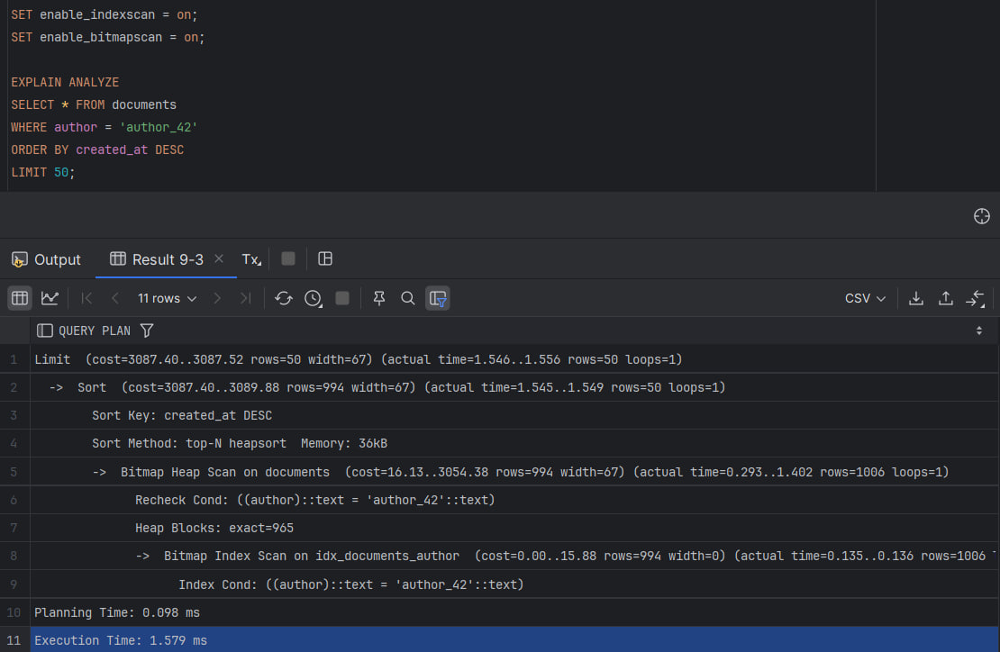

### 1. Пояснение по индексам

> CREATE INDEX idx_documents_created_at ON documents(created_at);
> > Используется при сортировке по дате.

> CREATE INDEX idx_documents_search ON documents(author, status, created_at DESC); 
> > Используется при поиске по author+status+created_at единовременно, сработает также, если поиск только по author, либо author+status.

> CREATE INDEX idx_document_history_document_id ON document_history(document_id);
> > Испозуется при поиске всей истории документа по вторичному ключу

> CREATE INDEX idx_registries_document_id ON registries(document_id);
> > Испозуется при поиске всей истории документа по вторичному ключу.

### 2. Пример запроса, использующего индекс

> Я создал 1 000 000 документов и сравнил скорость поиска по author без индекса | с индексом. Время выполнения запроса уменьшилось в 25 раз, прилагаю скрины с запросом и его планом выполнения.

> Запрос без индекса: 

> Запрос с индексом: 